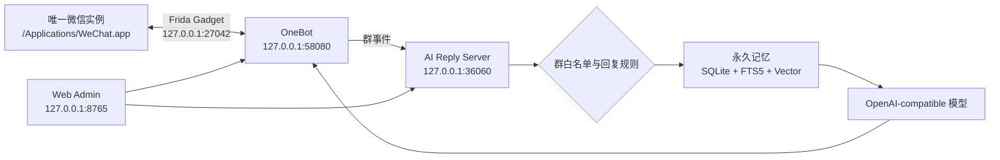

<div align="center">

# WeChat Mac Hook Advanced

### macOS 唯一微信实例 · 高速记忆基础设施 · Hermes 自动化

当前分支只适配本机唯一安装的官方微信，不再包含微信复制、Bundle ID 修改、容器重定向或多开启动流程。

</div>

## 版本选择

| 版本 | 仓库 | 适合人群 |
| --- | --- | --- |
| **Advanced（当前仓库）** | `xiaoguiwucan/wechat-mac-hook` | 需要 PostgreSQL、MinIO、PGroonga、pgvector、Graphiti、FalkorDB、Hermes WebUI/工具/Cron 的完整版本 |
| **Classic** | [`xiaoguiwucan/wechat-mac-hook-classic`](https://github.com/xiaoguiwucan/wechat-mac-hook-classic) | 只需要唯一微信、OneBot、SQLite 本地记忆和基础 AI 回复，追求轻量部署 |

两个仓库从提交 `7fce3bc` 分开维护。Advanced 继续开发完整记忆与自动化；
Classic 只接受稳定性、微信兼容性和基础回复修复，不再合入重型基础设施。

## 当前适配目标

| 项目 | 固定值 |
| --- | --- |
| App | `/Applications/WeChat.app` |
| Bundle ID | `com.tencent.xinWeChat` |
| 微信版本 | `4.1.11.53` |
| Build | `269109` |
| 微信数据 | `~/Library/Containers/com.tencent.xinWeChat` |
| 项目状态 | `~/Library/Application Support/WeChatAgent` |
| OneBot | `127.0.0.1:58080` |
| AI Reply | `127.0.0.1:36060` |
| Web Admin | `127.0.0.1:8765` |

启动脚本只复用上述 App 的唯一主进程。检测到其他 WeChat 主进程路径时会停止；脚本不会传入 `-n`、`--allow_multi_open` 或 `--multi_open`。

## 架构



## 功能

- OneBot 接收真实群消息、引用、图片、语音、表情和拍一拍事件。
- 支持文字、图片、文件、视频、语音和原生表情发送。
- 群白名单、群级回复开关、阈值、称呼、性格、管理员与成员黑名单。
- SQLite WAL、FTS5、向量检索、人物画像、关系、群梗和媒体记忆。
- OCR、ASR、Embedding、Reranker、语音包、表情库和 OpenAI-compatible 生图。
- Web 后台提供运行状态、模型配置、群聊策略、回复任务、日志和链路测试。

## 快速开始

### 1. 准备配置

```bash
cp config/ai_reply_config.example.json config/ai_reply_config.json
cp config/ai_reply.env.example config/ai_reply.env
chmod 600 config/ai_reply.env
```

在 `config/ai_reply.env` 配置模型渠道，例如：

```bash
export OPENAI_API_KEY="sk-your-key"
export AI_REPLY_BASE_URL="https://your-openai-compatible-service.example/v1"
export AI_REPLY_MODEL="your-model"
```

### 2. 核验唯一微信

```bash
./scripts/detect_wechat_version.sh
./scripts/launch_wechat.sh
```

期望输出包含：

```text
WeChatBundleVersion=4.1.11.53
CFBundleVersion=269109
SuggestedConf=.../tools/onebot/wechat_version/4_1_11_53_mac.json
```

微信已运行时 `launch_wechat.sh` 会直接复用现有 PID，不会重启登录态。

### 3. 安装 Frida Gadget

SIP 保持开启时，按上游 `frida-gadget/readme.md` 将 Frida Gadget 注入当前唯一安装的微信。脚本会先把官方 App 压缩备份到 `~/Library/Application Support/WeChatAgent/migration-backups/`，不创建第二个可运行微信：

```bash
sudo ./scripts/install_frida_gadget.sh
WECHAT_RESTART=1 ./scripts/launch_wechat.sh
```

该步骤固定使用与 OneBot 构建一致的 Frida Gadget `17.8.0`，仅监听 `127.0.0.1:27042`。微信更新后摘要或版本发生变化时脚本会停止，需先更新适配配置。

macOS 26 下安装脚本使用不带受限 entitlement 的纯 ad-hoc 签名；Gadget 模式不执行 `task_for_pid`，因此不需要 `get-task-allow`、关闭 SIP 或 Developer Tools PID 附加权限。安装脚本检测到微信仍在运行时会停止，避免运行中重签造成 `Code Signature Invalid`。

### 4. 启动服务

```bash
./scripts/start_onebot.sh
./scripts/start_ai_reply.sh
./scripts/start_web_admin.sh
```

或使用聚合入口：

```bash
./scripts/run_wechat_ai_reply.sh
```

打开管理后台：<http://127.0.0.1:8765/>

## 常用命令

| 操作 | 命令 |
| --- | --- |
| 检测微信版本 | `./scripts/detect_wechat_version.sh` |
| 安装/刷新 Frida Gadget | `sudo ./scripts/install_frida_gadget.sh` |
| 启动或前置唯一微信 | `./scripts/launch_wechat.sh` |
| 启动 OneBot | `./scripts/start_onebot.sh` |
| 启动 AI | `./scripts/start_ai_reply.sh` |
| 启动 Web 后台 | `./scripts/start_web_admin.sh` |
| 启动中央记忆服务 | `docker compose --env-file infrastructure/.env -f infrastructure/docker-compose.yml up -d` |
| 导入微信 4.x 历史 | `PYTHONPATH=tools/runtime/python python3 scripts/import_wechat4_history.py` |
| 备份中央记忆 | `./scripts/backup_durable_memory.sh` |
| 查看微信 / OneBot | `./scripts/status_wechat_onebot.sh` |
| 查看 AI | `./scripts/status_ai_reply.sh` |
| 停止 OneBot | `./scripts/stop_onebot.sh` |
| 停止 AI | `./scripts/stop_ai_reply.sh` |
| 停止 Web 后台 | `./scripts/stop_web_admin.sh` |
| 停止 AI + OneBot | `./scripts/stop_backend.sh` |

## 健康检查

```bash
curl -fsS http://127.0.0.1:8765/api/status
curl -fsS http://127.0.0.1:36060/health
curl -fsS http://127.0.0.1:58080/status
```

关键运行字段：

- `wechat.running`：唯一微信进程是否存在。
- `onebot.attached_current_wechat`：OneBot 是否附加到当前微信 PID。
- `onebot.hook_ready`：接收 Hook 是否就绪。
- `onebot.send_ready`：是否已捕获发送上下文。
- `onebot.media_upload_ready`：媒体上传通道是否完整就绪。
- `target.single_instance`：后台是否按唯一实例模型运行。

## 配置与数据

- 示例配置：`config/ai_reply_config.example.json`、`config/ai_reply.env.example`。
- 真实配置：`config/ai_reply_config.json`、`config/ai_reply.env`，默认不提交。
- 项目运行状态：`~/Library/Application Support/WeChatAgent`。
- 微信账号与媒体目录：官方 `com.tencent.xinWeChat` 容器。
- 当前版本地址配置：`tools/onebot/wechat_version/4_1_11_53_mac.json`。

## 开发检查

```bash
python3 -m py_compile web_admin/server.py ai_reply/ai_reply_server.py desktop_app/wechat_manager.py
node --check web_admin/static/app.js
python3 -m unittest discover -s tests -p 'test_*.py'
bash -n scripts/*.sh
rg -n 'WeChat2|instance2|allow_multi_open|multi_open|第二微信|多开' --glob '!CHANGELOG.md' --glob '!README.md' --glob '!RULES.md'
```

## 目录

```text
ai_reply/                       OneBot -> AI -> WeChat 回复服务
config/                         示例配置
memory_store.py                 SQLite、FTS5、向量与永久记忆
durable_sync.py                 PostgreSQL / MinIO 可靠同步
graphiti_bridge.py              Graphiti / FalkorDB 时序记忆投影
hermes_automation.py            Hermes API 异步自动化与权限
infrastructure/                 PostgreSQL、MinIO、FalkorDB 编排
scripts/                        单实例启动、停止、状态和验证脚本
tools/onebot/                   OneBot 与微信版本地址配置
tools/voice_transcript_ocr/     可选本地 OCR
tools/voice_transcript_sidecar/ 可选语音转写观察器
web_admin/                      Web 管理后台
```

## License

GPL-3.0，见 [LICENSE](LICENSE)。
