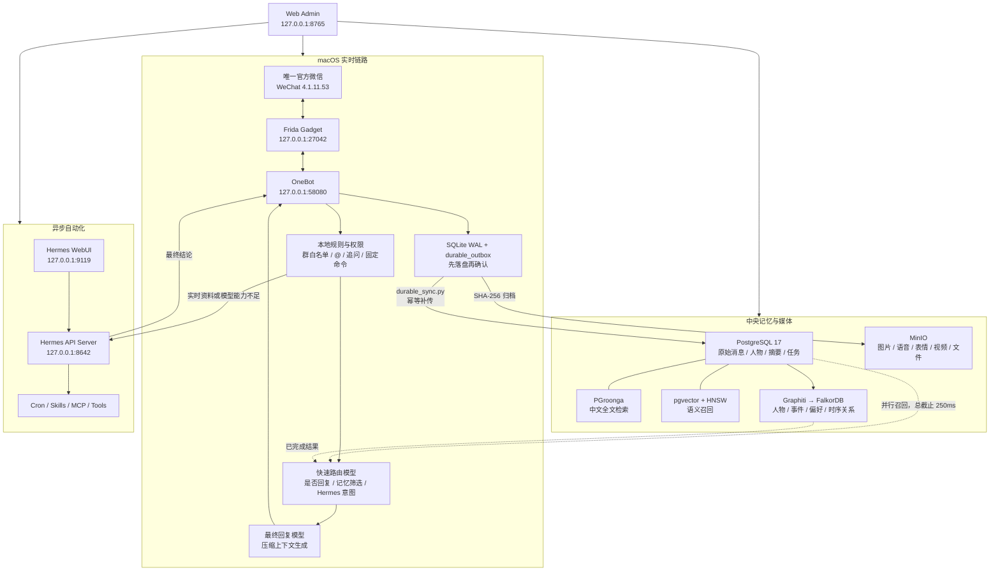

<div align="center">

# WeChat Mac Hook Advanced

### 唯一官方微信 · 可靠中央记忆 · 时序关系图 · Hermes 自动化

[](#advanced-版本定位)
[](#运行要求)
[](#当前适配目标)
[](LICENSE)

在 macOS 上复用**唯一一个官方微信进程**，通过 Frida Gadget 和 OneBot 接收、分析并发送群消息；<br>
在轻量实时回复链路之外，增加 PostgreSQL、MinIO、PGroonga、pgvector、Graphiti、
FalkorDB 和 Hermes，组成可追溯的长期记忆与异步自动化平台。

[快速开始](#快速开始) · [架构说明](#系统架构) · [后台页面](#web-管理后台) ·
[Hermes](#hermes-自动化) · [Classic 轻量版](https://github.com/xiaoguiwucan/wechat-mac-hook-classic)

</div>

> [!IMPORTANT]
> 本项目不创建第二个微信，不修改 Bundle ID，不使用 `-n`、`--allow_multi_open`
> 或 `--multi_open`。所有收发均复用 `/Applications/WeChat.app` 的唯一主进程。

## 版本选择

| 对比项 | **Advanced（当前项目）** | **Classic** |
| --- | --- | --- |
| GitHub | [`xiaoguiwucan/wechat-mac-hook`](https://github.com/xiaoguiwucan/wechat-mac-hook) | [`xiaoguiwucan/wechat-mac-hook-classic`](https://github.com/xiaoguiwucan/wechat-mac-hook-classic) |
| 适合场景 | 完整长期记忆、媒体归档、关系图、工具调用和定时任务 | 单机轻量群聊、SQLite 本地记忆 |
| 主数据 | PostgreSQL，Mac SQLite 作为可靠缓冲 | SQLite |
| 检索 | PGroonga + pgvector + 缓存 + Graphiti | SQLite FTS5 + 可选本地向量 |
| 媒体 | MinIO 永久归档、SHA-256 去重 | 本机文件和 SQLite 索引 |
| 关系记忆 | Graphiti + FalkorDB | SQLite 人物画像与关系表 |
| 自动化 | Hermes API、WebUI、Cron、审批与权限 | 不包含 |
| 部署成本 | 较高，需要 Docker 和多个服务 | 较低，Python + 唯一微信即可 |

两个项目从提交 `7fce3bc` 分开维护：

- **Advanced**：继续开发中央记忆、关系图、Hermes 工具和运维自动化。
- **Classic**：只维护微信兼容性、稳定性、安全和基础 AI 功能。
- 微信 Hook 的通用修复可以双向移植；重型基础设施只进入 Advanced。

## Advanced 版本定位

Advanced 不是简单的“聊天机器人加数据库”，而是把实时回复、可靠归档、深层记忆和
自动化拆成互不阻塞的四条链路。

| 层级 | 职责 | 失败时的处理 |
| --- | --- | --- |
| 微信接入层 | 唯一微信、Frida Gadget、OneBot 收发 | 不启动第二微信；健康检查直接暴露附加状态 |
| 实时回复层 | 群规则、快速路由、250ms 记忆召回、最终回复 | 深层检索超时立即使用近期消息和缓存回答 |
| 持久记忆层 | SQLite outbox、PostgreSQL、MinIO、全文与向量 | 中央服务离线时先写本机，恢复后幂等补传 |
| 关系记忆层 | Graphiti/FalkorDB 投影人物、事件、偏好和有效时间 | 独立后台工作池，不占用实时回复线程 |
| 自动化层 | Hermes 工具、Cron、审批、停止和结果回传 | 创建后立即回执，任务异步运行 |
| 管理与观测层 | Web Admin、状态、配置、任务、日志、链路指标 | 服务状态和最近错误集中展示 |

### 已实现与仍需验收

| 状态 | 内容 |
| --- | --- |
| 已实现 | SQLite 可靠 outbox、PostgreSQL/PGroonga/pgvector 结构、MinIO 媒体归档 |
| 已实现 | 250ms 召回截止、缓存降级、Graphiti/FalkorDB 后台桥接 |
| 已实现 | Hermes API 接入、只读/写入/高风险分级、审批、停止、Cron 管理 |
| 已实现 | 可操作的“记忆与自动化”后台、备份和微信 4.x 只读导入工具 |
| 待完整验收 | 当前账号所有群历史的最早/最晚时间及媒体完整度 |
| 进行中 | 零大模型内存的本地 Hash 向量、人物事实/摘要正在异步回填 PostgreSQL |
| 待完整验收 | Graphiti 历史积压清零、隔离恢复演练 |
| 待达到目标 | 普通回复 P50 ≤ 2.5 秒、P95 ≤ 5 秒 |
| 待逐项验收 | Hermes 真实代码写入、GitHub 推送和生产部署任务 |

## 当前适配目标

| 项目 | 当前固定值 |
| --- | --- |
| 微信 App | `/Applications/WeChat.app` |
| Bundle ID | `com.tencent.xinWeChat` |
| 微信版本 | `4.1.11.53` |
| Build | `269109` |
| 微信数据 | `~/Library/Containers/com.tencent.xinWeChat` |
| 项目运行状态 | `~/Library/Application Support/WeChatAgent` |
| Frida Gadget | `127.0.0.1:27042`，版本 `17.8.0` |
| OneBot | `http://127.0.0.1:58080` |
| AI Reply | `http://127.0.0.1:36060` |
| Web Admin | `http://127.0.0.1:8765` |
| Hermes API | `http://127.0.0.1:8642` |
| Hermes 官方 WebUI | `http://127.0.0.1:9119` |

微信版本、Build、Mach-O 摘要或 Hook 地址不匹配时，安装与启动脚本会停止，而不是
对未知版本继续注入。

## 系统架构



### 一条群消息如何被处理

1. OneBot 收到事件后，先在事务中写入本机 SQLite 和 `durable_outbox`。
2. 本地规则判断 @机器人、追问、群权限、固定命令和明显的自动化意图。
3. 最近消息、人物核心事实、PGroonga、已有向量和 Graphiti 并行召回。
4. 到达 `250ms` 总截止时间后立即收集已完成结果；慢查询继续后台执行。
5. 快速路由模型选择要注入的记忆，并判断是否需要 Hermes。
6. 普通问题交给最终回复模型；实时天气、联网查询或工具任务交给 Hermes。
7. 回复仍通过现有 OneBot 发送，不启用 Hermes 自带微信通道。
8. `durable_sync.py` 在后台把消息和媒体同步到 PostgreSQL、MinIO。

## 核心组件

| 组件 | 文件/服务 | 作用 |
| --- | --- | --- |
| 微信 Hook | `tools/onebot/`、`frida-gadget/` | 适配指定微信版本并提供 OneBot 收发 |
| AI Reply | `ai_reply/ai_reply_server.py` | 规则、路由、上下文编排、模型调用和回复 |
| 群聊大脑 | `brain_engine.py` | 回复机会评分、并发、节流和媒介选择 |
| 本地记忆 | `memory_store.py` | SQLite WAL、FTS5、人物画像、媒体索引、可靠 outbox |
| Embedding | `embedding_service.py` | 默认零模型内存 Hash 向量；可切换真实 Embedding，全部后台回填 |
| 中央同步 | `durable_sync.py` | PostgreSQL 幂等写入和 MinIO 媒体归档 |
| 关系投影 | `graphiti_bridge.py` | 把中央事件异步投影到 Graphiti/FalkorDB |
| Hermes | `hermes_automation.py` | 权限控制、异步任务、SSE 事件、审批与停止 |
| Web Admin | `web_admin/` | 配置、运行控制、日志、记忆和自动化界面 |
| 基础设施 | `infrastructure/` | PostgreSQL、MinIO、FalkorDB 的 Docker 编排 |

## 记忆系统

### 数据分层

| 记忆层 | 保存内容 | 主要读取方式 |
| --- | --- | --- |
| 工作记忆 | 当前消息和最近对话 | 进程缓存 / SQLite / PostgreSQL |
| 人物核心记忆 | 姓名、外号、偏好和稳定事实 | 常驻缓存 + 主库 |
| 群记忆 | 群规则、群梗、关系和长期摘要 | 缓存 + PostgreSQL |
| 情景记忆 | 某次讨论、决定、承诺和事件 | PGroonga + pgvector |
| 关系记忆 | 人物关系、事实有效时间和事件联系 | Graphiti + FalkorDB |
| 原始归档 | 所有消息和媒体原件 | PostgreSQL + MinIO |

所有长期事实均应保留来源消息 ID、群 ID、产生时间和有效状态。发生冲突时保留原始
历史，优先使用时间更新且证据明确的事实。

### 可靠性设计

- OneBot 回调先事务写入 Mac SQLite，中央服务不可用也不会丢失接收记录。
- 账号、群、消息 ID 和事件类型组成幂等标识，重放不会产生重复消息。
- PostgreSQL 确认后才把 outbox 标记完成。
- 媒体以 SHA-256 去重并上传 MinIO；上传成功后才标记归档完整。
- Embedding、OCR、Graphiti 和历史回填使用独立工作池，不阻塞实时回复。

### 速度与上下文预算

- 多路记忆召回共享 `250ms` 硬截止时间。
- Graphiti、向量或全文超时后直接使用近期消息、人物缓存和群摘要。
- 默认只注入高价值结果，而不是把全部历史塞给模型。
- 快速路由当前使用后台新增的 `deepseek-v4-flash`；空正文且推理被截断时自动扩大
  token 预算重试一次。最终回复按后台当前启用渠道配置。
- 路由模型离线时，明确 @、引用和命令仍按本地规则继续处理。

## Hermes 自动化

Hermes 是独立工具执行层，不是第二个微信机器人。

### 入口

| 入口 | 地址 | 说明 |
| --- | --- | --- |
| 官方 WebUI | <http://127.0.0.1:9119/> | Chat、Sessions、Models、Cron、Skills、Plugins、MCP、Config、Keys、System |
| API Server | <http://127.0.0.1:8642/> | 程序化接口；根路径可能返回 404，应检查健康接口 |
| 微信项目控制台 | <http://127.0.0.1:8765/#memory-infra> | 提交、审批、停止任务并查看结果 |

### 调用逻辑

- 天气、新闻、价格、比赛、联网搜索、网页读取等实时问题进入 `read` 模式。
- 普通模型产生“拿不到实时数据/不能联网”一类失败回复时，会在发送前尝试转交 Hermes。
- 代码修改、测试、Git 提交、部署和定时任务进入 `write` 或 `high` 模式。
- 长任务立即返回已接收状态，最终结果异步发送。
- Hermes 工具过程不进入普通聊天上下文，只保存最终结论和必要审计信息。

### 并发、缓存与群内回执

- `read / cron / ops / high` 四个隔离工作池分别使用 `16 / 6 / 8 / 2` 个线程，
  总计 32 个 Hermes 工作线程。
- Hermes API Server 并发 Run 上限同步设为 32，项目任务队列容量为 1000。
- 普通只读结果默认缓存 24 小时；天气 1 小时、行情 15 分钟、新闻 6 小时、
  状态 2 分钟。
- “强制刷新”“重新查询”“不要缓存”等明确表达会跳过缓存。
- 0～30 秒保持静默，只发送最终答案；超过 30 秒才发送一次“正在查询”。
- 代码、部署和其他长任务立即回执；高风险任务立即进入等待审批。
- Cron 触发结果统一回到 AI 服务的本机归档入口，再由唯一 OneBot 发送，不再绕过消息库。
- Hermes 工作区使用 `$HOME/Projects/wechat-agent-advanced` ASCII 符号链接，避免中文路径
  被终端安全策略拦截。
- 所有线程数、缓存时间和查询提示延迟都可以在
  <http://127.0.0.1:8765/#memory-infra> 修改。

### 权限

| 风险级别 | 默认权限 | 示例 |
| --- | --- | --- |
| `read` | 群成员 | 状态、天气、搜索、公开项目信息 |
| `write` | 配置的群管理员 | 测试、代码修改、Git 推送、普通部署、Cron |
| `high` | 管理员发起并再次确认 | 删除、强制推送、修改密钥、生产部署和回滚 |

项目所有者通过 `HERMES_OWNER_USER_IDS` 配置。每个任务保存发起人、群、原消息、
参数、Hermes run ID、工具事件和最终结果。

### 模型配置

Hermes 自己的模型、Key、Skills、MCP 和插件在官方 WebUI 的 **Models / Config /
Keys / Skills / MCP / Plugins** 页面管理；微信机器人只配置 Hermes API 地址、
工作目录、轮询间隔、最大运行时长和权限。两套模型配置彼此独立。

## Web 管理后台

打开 <http://127.0.0.1:8765/>。主要页面如下：

| 页面 | 地址 | 主要功能 |
| --- | --- | --- |
| 运行总览 | `/#overview` | 微信、OneBot、AI、消息和综合日志状态 |
| 模型配置 | `/#ai` | AI 渠道、主模型、OCR、ASR、生图和连通测试 |
| 群聊策略 | `/#groups` | 目标群、回复开关、群管理员、黑名单和群性格 |
| 群聊大脑 | `/#brain` | 回复评分、阈值、并发、节流和媒介策略 |
| 实时对话 | `/#reply-tasks` | 排队、召回、生成和发送阶段耗时 |
| 评估看板 | `/#tests` | 模型及回复链路评估 |
| 用户画像 | `/#personas` | 成员事实、关系、风格和群内画像 |
| 记忆与自动化 | `/#memory-infra` | PostgreSQL、MinIO、Graphiti、Hermes 配置与操作 |
| 记忆数据库 | `/#memory` | 原始聊天、摘要、事实和检索记录 |
| 图片图库 | `/#media` | 图片内容、标签和媒体状态 |
| 语音内容 | `/#voice-records` | 语音记录与转写 |
| 语音包管理 | `/#voices` | 扫描、压缩包导入、试听和分类 |
| 表情包管理 | `/#faces` | 表情资产、分类和发送测试 |
| 完整日志 | `/#logs` | AI/OneBot 实时日志、群、级别和 trace ID 筛选 |

“记忆与自动化”页面不是只读展示页：可以保存路由、检索预算、Graphiti 和 Hermes
配置，执行健康检查、重试、备份、任务提交、审批和停止操作。

## 运行要求

- Apple Silicon macOS；当前适配和实测目标为 macOS 26。
- 官方微信 `4.1.11.53 (269109)`。
- Python 3、Node.js（前端语法检查）、Go（需要重新构建 SILK 工具时）。
- Docker Desktop 或兼容的 Docker Compose，用于 PostgreSQL、MinIO、FalkorDB。
- 一个 OpenAI-compatible 模型渠道。
- Hermes Agent API/WebUI；只使用聊天功能时可以暂不启动 Hermes。

## 快速开始

### 1. 克隆并准备应用配置

```bash
git clone https://github.com/xiaoguiwucan/wechat-mac-hook.git
cd wechat-mac-hook

cp config/ai_reply_config.example.json config/ai_reply_config.json
cp config/ai_reply.env.example config/ai_reply.env
chmod 600 config/ai_reply.env
```

编辑 `config/ai_reply.env`：

```bash
export OPENAI_API_KEY="YOUR_API_KEY"
export AI_REPLY_BASE_URL="https://YOUR_OPENAI_COMPATIBLE_ENDPOINT/v1"
export AI_REPLY_MODEL="YOUR_FINAL_MODEL"
```

真实密钥文件已被 Git 忽略，不要提交到仓库。

### 2. 启动中央基础设施

```bash
cp infrastructure/.env.example infrastructure/.env
# 修改 infrastructure/.env 中的 PostgreSQL 与 MinIO 密码

docker compose --env-file infrastructure/.env \
  -f infrastructure/docker-compose.yml up -d --build
```

查看状态：

```bash
docker compose --env-file infrastructure/.env \
  -f infrastructure/docker-compose.yml ps
```

### 3. 核验唯一微信

```bash
./scripts/detect_wechat_version.sh
./scripts/launch_wechat.sh
```

期望包含：

```text
WeChatBundleVersion=4.1.11.53
CFBundleVersion=269109
SuggestedConf=.../tools/onebot/wechat_version/4_1_11_53_mac.json
```

微信已经运行时会复用当前 PID，不会重启登录态。

### 4. 安装 Frida Gadget

安装脚本会先把官方 App 压缩备份到
`~/Library/Application Support/WeChatAgent/migration-backups/`，不会创建第二个可运行微信。

```bash
sudo ./scripts/install_frida_gadget.sh
WECHAT_RESTART=1 ./scripts/launch_wechat.sh
```

Gadget 固定监听本机 `127.0.0.1:27042`。安装时若微信仍在运行，脚本会停止，避免
运行中重签导致 `Code Signature Invalid`。

### 5. 启动机器人与后台

```bash
./scripts/start_onebot.sh
./scripts/start_ai_reply.sh
./scripts/start_web_admin.sh
```

也可以使用聚合入口：

```bash
./scripts/run_wechat_ai_reply.sh
```

随后打开 <http://127.0.0.1:8765/>。

## 服务与端口

| 服务 | 默认地址 | 是否必需 |
| --- | --- | --- |
| Frida Gadget | `127.0.0.1:27042` | 是 |
| OneBot | `127.0.0.1:58080` | 是 |
| AI Reply | `127.0.0.1:36060` | 是 |
| Web Admin | `127.0.0.1:8765` | 推荐 |
| PostgreSQL | `127.0.0.1:5432` | Advanced 记忆必需 |
| MinIO API | `127.0.0.1:9000` | 媒体归档必需 |
| MinIO Console | `127.0.0.1:9001` | 可选管理入口 |
| FalkorDB | `127.0.0.1:6379` | 关系记忆必需 |
| FalkorDB Browser | `${FALKORDB_UI_PORT:-3001}` | 可选管理入口 |
| Hermes API | `127.0.0.1:8642` | 自动化必需 |
| Hermes WebUI | `127.0.0.1:9119` | 推荐 |

所有默认端口只绑定 `127.0.0.1`，不直接暴露到局域网或公网。

## 常用运维命令

| 操作 | 命令 |
| --- | --- |
| 检测微信版本 | `./scripts/detect_wechat_version.sh` |
| 安装/刷新 Gadget | `sudo ./scripts/install_frida_gadget.sh` |
| 启动或前置唯一微信 | `./scripts/launch_wechat.sh` |
| 启动 OneBot | `./scripts/start_onebot.sh` |
| 启动 AI | `./scripts/start_ai_reply.sh` |
| 启动 Web 后台 | `./scripts/start_web_admin.sh` |
| 查看微信 / OneBot | `./scripts/status_wechat_onebot.sh` |
| 查看 AI | `./scripts/status_ai_reply.sh` |
| 导入微信 4.x 历史 | `PYTHONPATH=tools/runtime/python python3 scripts/import_wechat4_history.py` |
| 把旧 SQLite 补入 outbox | `PYTHONPATH=tools/runtime/python python3 scripts/migrate_sqlite_to_postgres.py` |
| 备份中央记忆 | `./scripts/backup_durable_memory.sh` |
| 校验备份与全部媒体 | `./scripts/verify_memory_backup.sh backups/时间目录` |
| 安装 AI/Web 登录守护 | `./scripts/install_launch_agents.sh` |

`install_launch_agents.sh` 会先做真实健康检查；若 macOS 的 Documents 隐私策略
阻止 LaunchAgent 读取项目，它会自动卸载失败项并退出，不留下反复重启的后台任务。
这种情况下现有手动守护继续运行，授予文件访问权限后再执行安装脚本。
| 停止 AI + OneBot | `./scripts/stop_backend.sh` |
| 停止 Web 后台 | `./scripts/stop_web_admin.sh` |

## 健康检查

```bash
curl -fsS http://127.0.0.1:8765/api/status
curl -fsS http://127.0.0.1:36060/health
curl -fsS http://127.0.0.1:58080/status
curl -fsS http://127.0.0.1:8642/health/detailed
```

重点字段：

- `wechat.running`：唯一微信主进程是否存在。
- `onebot.attached_current_wechat`：OneBot 是否附加到当前微信 PID。
- `onebot.hook_ready`：接收 Hook 是否就绪。
- `onebot.send_ready`：是否已经捕获发送上下文。
- `onebot.media_upload_ready`：媒体上传通道是否完整。
- `target.single_instance`：是否遵守唯一微信模型。
- `hermes.healthy`：Hermes API 是否可用。

## 配置与数据位置

| 类型 | 路径 |
| --- | --- |
| 配置模板 | `config/ai_reply_config.example.json`、`config/ai_reply.env.example` |
| 本机真实配置 | `config/ai_reply_config.json`、`config/ai_reply.env` |
| 基础设施配置 | `infrastructure/.env`、`infrastructure/docker-compose.yml` |
| 项目运行状态 | `~/Library/Application Support/WeChatAgent` |
| 微信官方数据 | `~/Library/Containers/com.tencent.xinWeChat` |
| 微信版本地址配置 | `tools/onebot/wechat_version/4_1_11_53_mac.json` |
| Docker 持久卷 | `postgres-data`、`minio-data`、`falkordb-data` |

## 开发检查

```bash
python3 -m py_compile \
  web_admin/server.py ai_reply/ai_reply_server.py \
  memory_store.py durable_sync.py graphiti_bridge.py hermes_automation.py

node --check web_admin/static/app.js
python3 -m unittest discover -s tests -p 'test_*.py'
bash -n scripts/*.sh
git diff --check
```

确认没有重新引入多开逻辑：

```bash
rg -n 'WeChat2|instance2|allow_multi_open|multi_open|第二微信|多开' \
  --glob '!CHANGELOG.md' --glob '!README.md' --glob '!RULES.md'
```

## 项目目录

```text
ai_reply/                       OneBot → AI → 微信实时回复服务
config/                         应用配置模板与本机配置
docs/                           架构与实施说明
infrastructure/                 PostgreSQL、MinIO、FalkorDB 编排
scripts/                        启动、停止、迁移、备份和验证脚本
tools/onebot/                   OneBot 与微信版本地址配置
tools/voice_transcript_ocr/     可选本地 OCR
tools/voice_transcript_sidecar/ 可选语音转写观察器
web_admin/                      Web 管理后台
memory_store.py                 SQLite、FTS5、本地记忆与可靠 outbox
durable_sync.py                 PostgreSQL / MinIO 可靠同步
graphiti_bridge.py              Graphiti / FalkorDB 时序记忆投影
hermes_automation.py            Hermes 异步任务、权限与审计
embedding_service.py            可选 Embedding / Reranker
```

## 常见问题

<details>
<summary><strong>为什么只允许一个微信？</strong></summary>

项目的版本识别、Frida Gadget、OneBot 附加、官方容器和登录态都围绕
`/Applications/WeChat.app` 设计。第二 App、修改 Bundle ID 或容器重定向会造成身份、
权限、消息和媒体路径漂移，因此 Advanced 与 Classic 都坚持唯一官方微信。
</details>

<details>
<summary><strong>PostgreSQL、MinIO 或 Graphiti 停了还能回复吗？</strong></summary>

可以。消息先进入 SQLite，实时召回达到截止时间后使用近期对话和缓存继续回答。
中央同步、媒体归档和关系图会出现积压，服务恢复后再补传或重试。
</details>

<details>
<summary><strong>必须运行 8B 本地向量模型吗？</strong></summary>

不必须。默认 `embedding.backend=local_hash`，用字符 n-gram 生成低内存向量，不加载
8B 模型；全文检索、人物缓存和 Graphiti 同时保留。需要更高语义质量时可在后台切换
真实 Embedding，实时回复仍受 250ms 截止保护。
</details>

<details>
<summary><strong>为什么 Hermes API 根地址打不开？</strong></summary>

`8642` 是程序化 API，根路径可能返回 404；浏览器管理页面是
<http://127.0.0.1:9119/>。微信侧任务控制在
<http://127.0.0.1:8765/#memory-infra>。
</details>

<details>
<summary><strong>微信升级后可以直接继续用吗？</strong></summary>

不建议。先运行 `./scripts/detect_wechat_version.sh`，核对版本、Build、摘要和 Hook
地址配置。未知版本必须重新验证后再注入。
</details>

## License

本项目使用 GPL-3.0，详见 [LICENSE](LICENSE)。
