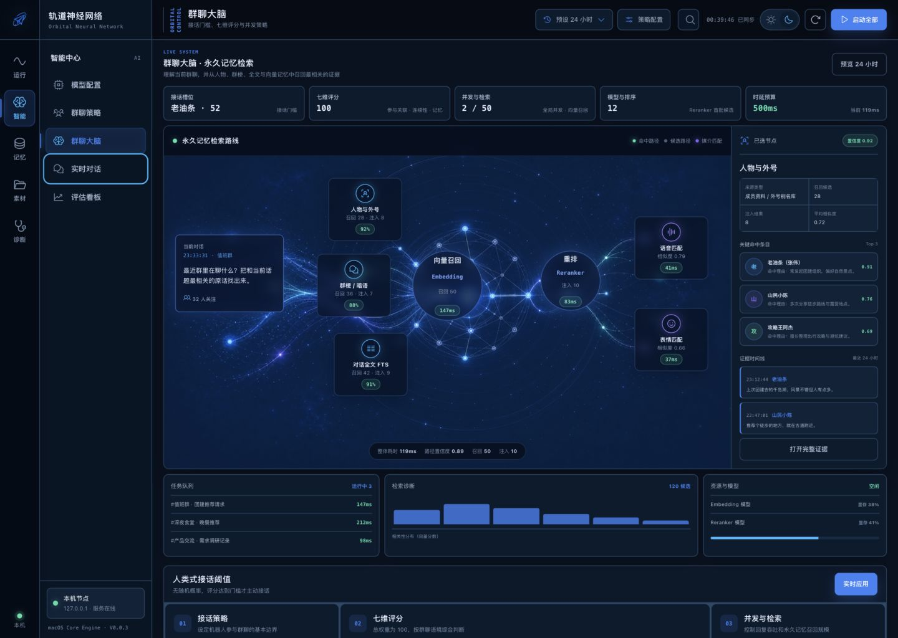
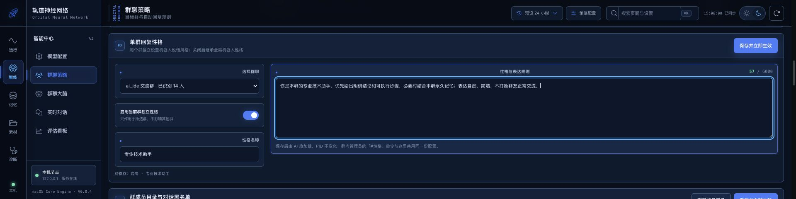
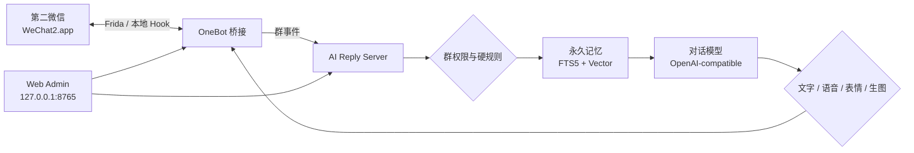

<div align="center">

# WeChat Mac Hook

### macOS 第二微信隔离运行 · OneBot 本地桥接 · AI 群聊大脑

一套面向本地部署的微信 macOS 自动化实验项目：在不触碰主微信数据的前提下运行第二微信，并提供群聊回复、永久记忆、多模态素材、群级权限和可视化运维后台。

<p>
  
  
  
  
  
</p>

[功能总览](#功能总览) · [使用条件](#使用条件) · [快速开始](#快速开始) · [群级配置](#群级配置) · [运行与诊断](#运行与诊断) · [开源协议](#开源协议)

</div>

> [!IMPORTANT]
> 本项目是本地实验性工具，不是微信官方产品。当前 Hook、地址和启动脚本重点适配 **微信 macOS 4.1.11.53（build 269109）**。微信升级后内部实现可能变化，请勿直接套用旧地址配置。

## 项目截图

下图来自项目真实运行后台，截图已移除账号、群 ID、密钥和本机路径。



<details>
<summary><strong>查看：每个群独立设置回复性格</strong></summary>



</details>

## 项目定位

`wechat-mac-hook` 将第二微信、OneBot、AI 回复服务和 Web 控制台组织为一条只在本机运行的链路：

- **主微信安全隔离**：默认只操作 `~/Applications/WeChat2.app`，拒绝误附加 `/Applications/WeChat.app`。
- **第二微信独立数据**：Hook 会重定向 HOME、容器、缓存和偏好设置等路径，避免与主微信共用运行数据。
- **OneBot 本地桥接**：接收真实群消息、引用、图片、语音、表情和拍一拍事件，并向第二微信发送结果。
- **群聊 AI 大脑**：支持强制触发、接话评分、并行线程、人物画像、永久群梗、向量检索和 Reranker。
- **群级精细控制**：回复开关、阈值、称呼、性格、黑名单、管理员和媒介概率均可按群隔离。
- **可观测后台**：统一查看服务状态、回复任务、模型耗时、媒体链路、记忆回填和错误日志。



## 功能总览

### 第二微信与 OneBot

- 第二微信 Bundle ID、版本和可执行文件安全校验。
- 主微信与第二微信进程、数据目录和运行状态隔离。
- 第二微信登录窗口本地 OCR 识别与“进入微信”自动点击。
- OneBot 文本、引用、@、图片、文件、视频、语音、表情发送。
- UploadMedia 状态诊断、PID 级缓存、失败确认和自动恢复。
- 禁止 30 分钟定时重启 OneBot；异常恢复按真实健康状态触发。

### 群聊回复引擎

- 七维社交机会评分与可调阈值，普通消息达到门槛才接话。
- `@机器人`、喊“小风”、引用机器人和显式命令强制回复，不受评分阈值约束。
- 不同群、成员和话题可并行处理；同一对话线程保持严格顺序。
- 回复任务状态机覆盖评分、检索、生成、选媒介、发送、完成与失败。
- 支持关闭“回复时艾特提问人”，关闭后普通文字只发送正文。
- `闭嘴` 口令可对当前群执行硬静默，到期后自动恢复。
- 重复问题去重与已发送结果保护，避免延迟任务在之后重复回答。

### 群级配置与管理员

- 每个群可独立设置启用状态、接话档位、阈值和回复称呼方式。
- 每个群可独立设置机器人性格，保存后热加载，其他群完全不受影响。
- `#菜单` 提供群内管理入口；管理员按真实 `group_id + user_id` 鉴权。
- 内置观察员、协管员、群管理员和自定义权限矩阵。
- 支持群级闭嘴、回复开关、媒介概率、黑名单、上下文重置和操作审计。
- 管理命令在评分和大模型前处理，即使机器人静默仍能恢复配置。

### 永久记忆与人物画像

- SQLite WAL、事务重试、FTS5 和真实 Float32 向量索引。
- 全部历史消息分批回填，不设置 5,000 条上限。
- 人物、群昵称、外号、关系、群梗、经典原话和历史事件永久保存。
- Qwen3 Embedding 多路召回，结合人物、时间、群梗、OCR、语音和全文路线。
- Qwen3 Reranker 对候选历史重排，结构化命中时可跳过，降低简单对话延迟。
- 独立“USR 用户画像”页面：成员目录、行为统计、关系图和证据时间线。
- 人工画像优先于自动结论，当前群画像可进入回复上下文与向量检索。

### 图片、语音、表情和生图

- 图片接收、OCR / Vision 解析、标签、摘要和引用图片精确关联。
- SILK 语音提取、WAV 转换、ASR 转写和语音内容检索。
- 语音包目录、ZIP、ZIP1 批量导入，支持分组、搜索、增删和即时索引。
- 表情素材 OCR、别名、情绪、意图、向量检索、去重和发送成功率管理。
- 自动媒介采用“语境适配 + 素材置信度 + 概率抽样”，不是固定关键词触发。
- 拍一拍绕过评分和模型，使用随机文字或微信原生动态表情快速回复。
- 支持通过独立 OpenAI-compatible 图像模型渠道执行 `/生图 <描述>`。

### Web 管理后台

- 深色 / 浅色主题、桌面和移动端响应式布局。
- 运行总览、模型配置、群聊策略、群聊大脑、实时对话、评估看板。
- 用户画像、本地向量、记忆数据库、图片、语音、语音包、表情管理。
- 回复任务、链路测试、日志、SSE 实时事件和服务健康状态。
- 配置写入采用文件锁与原子替换，保存后执行热加载，正常情况下 AI PID 不变化。

## 使用条件

### 必需条件

| 条件 | 说明 |
| --- | --- |
| macOS | Hook 构建脚本会根据当前机器生成 `arm64` 或 `x86_64` 动态库 |
| 微信版本 | 当前必须使用 macOS 微信 `4.1.11.53`，build `269109` |
| 第二微信 | 推荐放在 `~/Applications/WeChat2.app`，Bundle ID 必须为 `com.tencent.xinWeChat.instance2` |
| Xcode Command Line Tools | 构建 Hook 需要 `clang`、`codesign` 等系统工具 |
| Python | 建议 Python `3.11+`；启动脚本会优先寻找本机 `uv` 管理的 Python |
| AI 接口 | 至少配置一个可用的 OpenAI-compatible 对话模型渠道 |

### 按功能选装

| 条件 | 用途 |
| --- | --- |
| Go 1.25 | 仅在需要重新编译 OneBot 或语音 sidecar 时使用 |
| oMLX + Apple Silicon | 本地运行 Qwen3 Embedding / Reranker；不可用时仍可使用 FTS5 |
| OCR / Vision 模型 | 图片理解、表情解析与引用图片分析 |
| ASR 模型 | 语音自动转写与语音内容检索 |
| 图像模型渠道 | 对话中执行图片生成 |

### 使用边界

- 项目不提供微信安装包、已修改 App、账号、模型密钥或商业服务。
- 请仅在你拥有或获准管理的设备、账号和群聊中使用。
- 第二微信与 OneBot 依赖具体微信版本，升级前应备份并重新验证。
- 是否需要调整 SIP 取决于你的本地注入方式；请优先采用项目已有的隔离与签名流程，不要对主微信执行修改。
- 自动回复可能产生误判或不适当内容，上线前请先使用测试群、演练模式和群白名单。

## 快速开始

### 1. 克隆并准备配置

```bash
git clone https://github.com/xiaoguiwucan/wechat-mac-hook.git
cd wechat-mac-hook

cp config/ai_reply_config.example.json config/ai_reply_config.json
cp config/ai_reply.env.example config/ai_reply.env
chmod 600 config/ai_reply.env
```

在 `config/ai_reply.env` 中填写模型密钥。不要把真实密钥写进 JSON、README、截图或 Git 提交：

```bash
export OPENAI_API_KEY="sk-your-key"
export AI_REPLY_BASE_URL="https://your-openai-compatible-service.example/v1"
export AI_REPLY_MODEL="your-model"
```

### 2. 构建隔离 Hook

```bash
./scripts/build.sh
```

输出文件为 `build/WeChatSecondHook.dylib`，脚本会自动选择当前 Mac 的 CPU 架构并执行临时签名。

### 3. 准备第二微信

默认路径：

```text
~/Applications/WeChat2.app
```

启动脚本会核验：

- 目标不是系统主微信；
- Bundle ID 是 `com.tencent.xinWeChat.instance2`；
- 微信 build 是 `269109`；
- 已运行的第二微信默认不会被强制结束。

### 4. 启动完整链路

```bash
./scripts/launch_wechat2_4_1_11_53.sh
./scripts/start_onebot_wechat2.sh
./scripts/start_ai_reply.sh
./scripts/start_web_admin.sh
```

打开管理后台：

```text
http://127.0.0.1:8765/
```

### 5. 首次配置

建议按以下顺序完成：

1. 在“模型配置”新增并测试主对话模型。
2. 在“群聊策略”确认真实群名，并勾选允许普通 AI 回复的群。
3. 设置接话阈值、强制触发、回复时是否艾特提问人。
4. 如需不同群不同风格，进入“群聊策略 → 03 单群回复性格”。
5. 按需启用 OCR、ASR、Embedding、Reranker、语音、表情和生图渠道。
6. 使用“测试中心”和小范围测试群验证后，再开放到正式群。

## 群级配置

### 单群回复性格

路径：**智能 → 群聊策略 → 03 单群回复性格**

- 选择一个真实群聊；
- 开启“当前群独立性格”；
- 填写性格名称与表达规则；
- 点击“保存并立即生效”。

配置保存在 `group_personalities`，按真实群 ID 隔离。关闭后只继承全局性格；保存通过热加载生效，不需要重启 AI 服务。群内管理员的 `#性格` 命令与后台使用同一份配置。

### 群内管理员菜单

所有群友可发送 `#菜单` 查看入口，只有后台授权的当前群管理员可以执行操作。常用命令示例：

```text
#状态
#机器人 开
#闭嘴 3m
#开口
#档位 自然
#阈值 65
#艾特 关
#语音 30
#表情 50
#性格 查看
```

管理员身份只按原始微信成员 ID 鉴权，昵称变化不会导致权限丢失，同名成员不会继承权限，不同群之间不会串权。

## 运行与诊断

### 常用命令

| 操作 | 命令 |
| --- | --- |
| 构建 Hook | `./scripts/build.sh` |
| 启动第二微信 | `./scripts/launch_wechat2_4_1_11_53.sh` |
| 启动 OneBot | `./scripts/start_onebot_wechat2.sh` |
| 启动 AI 回复服务 | `./scripts/start_ai_reply.sh` |
| 启动 Web 后台 | `./scripts/start_web_admin.sh` |
| 查看 WeChat2 / OneBot | `./scripts/status_wechat2_onebot.sh` |
| 查看 AI 状态 | `./scripts/status_ai_reply.sh` |
| 停止 OneBot | `./scripts/stop_onebot_wechat2.sh` |
| 停止 AI | `./scripts/stop_ai_reply.sh` |
| 停止 Web 后台 | `./scripts/stop_web_admin.sh` |

### 健康检查

```bash
curl -fsS http://127.0.0.1:8765/api/status
curl -fsS http://127.0.0.1:36060/health
curl -fsS http://127.0.0.1:58080/status
```

判断媒体链路是否可用时，请优先看 OneBot 的真实运行字段：

- `self_id`
- `send_ready`
- `media_upload_ready`
- `upload_x0_ready`
- `pending_items`

不要仅凭进程存在就判断发送链路正常。

## 目录结构

```text
wechat-mac-hook/
├── ai_reply/                     # OneBot -> AI -> OneBot 回复服务
├── config/                       # 示例配置；真实运行配置不提交
├── docs/images/                  # README 脱敏实机截图
├── memory_store.py               # SQLite、FTS5、向量与永久记忆
├── scripts/                      # 构建、启动、停止、状态与验证脚本
├── src/                          # 第二微信隔离 Hook
├── tools/onebot/                 # OneBot 脚本与版本地址配置
├── tools/voice_transcript_ocr/   # 可选语音文字观察器
├── tools/voice_transcript_sidecar/ # 可选语音转写 sidecar
├── vendor/wechat_chatter/        # 上游参考源码与独立协议
└── web_admin/                    # Web 管理后台
```

## 配置、隐私与安全

仓库的 `.gitignore` 默认排除：

- `config/ai_reply.env` 与真实 `config/ai_reply_config.json`
- API Key、PID、日志、运行锁和本地状态
- 微信 App、安装包、构建产物和 OneBot 二进制
- 群聊图片、语音、表情、数据库、截图和测试输出

提交代码前仍应主动检查：

```bash
git status --short
git diff --check
git grep -nE 'sk-[A-Za-z0-9_-]{16,}|@chatroom|wxid_' -- ':!README.md'
```

如果密钥曾出现在聊天、日志、截图或提交记录中，应立即在服务商后台作废并重新生成；仅从本机环境变量读取新密钥。

## 常见问题

<details>
<summary><strong>后台能打开，但机器人不回复</strong></summary>

依次检查 AI 服务 `36060/health`、OneBot `58080/status`、目标群授权、群回复开关、静默状态、黑名单和强制触发识别。普通消息低于接话阈值时旁听属于预期行为。

</details>

<details>
<summary><strong>@机器人或喊“小风”仍被评分拦截</strong></summary>

检查 OneBot 是否保留了原始 @ 元数据、CDATA 和机器人身份。强制触发必须在评分前识别；后台任务应显示强制触发原因，而不是“评分低于阈值”。

</details>

<details>
<summary><strong>图片、语音或表情发送失败</strong></summary>

先检查 `media_upload_ready`、`upload_x0_ready` 和 `pending_items`。动态表情优先走微信原生 `type=8` 通道；普通图片、GIF 和语音仍可能需要 UploadMedia。

</details>

<details>
<summary><strong>修改群性格后没有变化</strong></summary>

确认选择了正确真实群、独立性格开关已开启，并看到“热加载成功”。群配置按真实群 ID 隔离；关闭独立性格后会重新使用全局性格。

</details>

## 开源协议

本仓库主代码以 **GNU General Public License v3.0（GPL-3.0）** 开源，完整条款见 [LICENSE](LICENSE)。

你可以在遵守 GPL-3.0 的前提下使用、研究、修改和再分发本项目。分发修改版本或基于本项目形成的衍生作品时，应保留版权与协议声明，并按 GPL-3.0 提供对应源代码。

`vendor/`、`external/` 以及其他第三方组件可能拥有独立版权和协议；它们继续遵循各自目录中的 `LICENSE`、源码头和上游声明。本项目名称、代码和截图不代表微信、腾讯、Frida、OneBot、OpenAI、Qwen 或其他项目的官方认可。

## 免责声明

- 本项目仅用于技术研究、互操作测试和个人自动化实验。
- 使用者应自行遵守所在地法律法规、微信服务条款及所在群聊的管理规则。
- Hook、自动化和非官方接口可能导致功能失效、数据损坏或账号风险。
- 维护者不对账号限制、数据丢失、模型输出、群聊纠纷或间接损失承担责任。

---

<div align="center">

**Local first · Group isolated · Observable by design**

如果这个项目对你有帮助，欢迎通过 Issue 提交可复现的问题与日志脱敏后的诊断信息。

</div>
