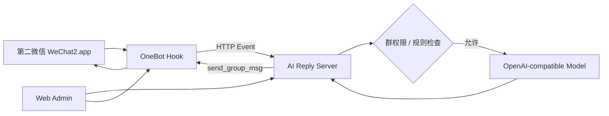
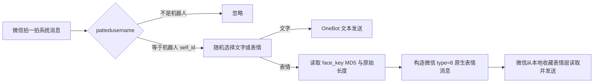

<div align="center">

# WeChat Mac Hook

**macOS 第二微信隔离运行、OneBot 接入与 AI 群聊值班后台**

<p>
  
  
  
  
</p>

</div>

---

## ✨ 项目定位

`wechat-mac-hook` 是一个面向 macOS 的本地化微信第二实例实验项目，核心目标是：

- **只操作第二微信**：默认目标为 `~/Applications/WeChat2.app`，不修改、不附加、不重签主微信 `/Applications/WeChat.app`。
- **隔离第二微信数据**：通过本地 hook 将第二微信的数据目录、缓存、偏好设置与 Group Container 重定向到独立目录。
- **接入 OneBot**：将第二微信消息事件转换为本地 HTTP 回调，便于自动化处理。
- **接入大模型**：支持 OpenAI-compatible / DeepSeek / 第三方 API 中转站，多渠道健康检查与失败自动切换。
- **提供 Web 管理后台**：在浏览器里完成运行状态、模型渠道、群权限、机器人性格、测试中心和实时日志管理。

> 当前版本：`V0.0.4`，适配重点为 **微信 macOS 4.1.11.53**。

---

## 🧩 功能总览

| 模块 | 能力 |
| --- | --- |
| 第二微信隔离 | Hook `HOME`、常见文件 API、容器路径与偏好设置路径，避免写入主微信数据目录 |
| 第二微信启动 | 检查 Bundle ID / Build，默认只启动 `~/Applications/WeChat2.app` |
| OneBot 接入 | 本地 HTTP 接收端口 `58080`，回调 AI 服务端口 `36060` |
| AI 回复 | 七维接话评分、可调门槛、强制触发、多线程生成、引用原消息回复 |
| 多模型渠道 | 支持多个 OpenAI-compatible 渠道、手动测试、自动健康检查、失败冷却与自动切换 |
| 群聊权限 | 从真实 OneBot 事件发现群 ID，勾选授权后才允许 AI 回复 |
| 机器人性格 | 独立人格/风格编辑器，写入系统提示词并严格参与回复生成 |
| 永久群聊大脑 | 永久人物/外号/关系/群梗/历史事件，全部历史回填，FTS5 + 4096 维 sqlite-vec + Reranker |
| 本地向量模型 | oMLX Qwen3-Embedding-8B，4B 性能备用，Qwen3-Reranker-4B，断点回填和在线检索优先 |
| 多线程回复 | 全局 8、每群 3 个默认并发，同线程串行、跨群并行、群级公平轮询 |
| 图片理解 | 图片图库、OCR / Vision 自动分析、标签、关键词、摘要与人工标注 |
| 语音理解 | 原始语音提取、SILK 转 WAV、ASR 自动转写与语音内容检索 |
| 语音包 | 目录 / ZIP 批量导入、分类、搜索、推荐、预览和 AI 自动选取发送 |
| 表情包 | 表情素材索引、OCR、搜索、标注和 AI 显式请求发送 |
| 拍一拍回复 | 仅在机器人本人被拍时触发，支持随机文字、多张图片和微信原生动态表情快速发送 |
| 自动登录 | 只监控第二微信授权登录窗口，本地 OCR 连续确认后自动点击“进入微信” |
| 媒体发送 | 文本、@、引用、图片、文件、视频、语音完整 OneBot 发送链路 |
| 媒体自修复 | 自动解析当前微信 UploadMedia 服务，按 PID 缓存并在失败时重试 |
| 链路诊断 | trace ID、最近链路、完整消息测试、OneBot 健康监控与恢复 |
| Web 后台 | 保留原十个独立功能页面，并新增群聊大脑、实时回复、本地向量三个独立入口；支持任务状态与配置热加载 |

---

## 🏗️ 项目结构

```text
wechat-mac-hook/
├── ai_reply/                  # OneBot -> AI -> OneBot 回复桥接服务
├── config/                    # 地址配置和示例配置；真实密钥文件不提交
├── desktop_app/               # 早期桌面管理器源码
├── memory_store.py            # SQLite 消息、成员、人格、媒体与语音包记忆层
├── scripts/                   # 构建、启动、停止、状态检查和测试脚本
├── src/                       # macOS 第二微信隔离 Hook 源码
├── tools/onebot/              # OneBot 脚本与微信版本地址配置；二进制不提交
├── tools/voice_transcript_ocr/ # 可选微信 UI 语音文字观察器源码
├── tools/voice_transcript_sidecar/ # 可选语音转文字 sidecar 源码
├── vendor/wechat_chatter/     # 参考项目源码快照
└── web_admin/                 # Web 管理后台
```

---

## 🚀 快速开始

### 1. 克隆项目

```bash
git clone https://github.com/xiaoguiwucan/wechat-mac-hook.git
cd wechat-mac-hook
```

### 2. 准备配置文件

```bash
cp config/ai_reply_config.example.json config/ai_reply_config.json
cp config/ai_reply.env.example config/ai_reply.env
chmod 600 config/ai_reply.env
```

在 `config/ai_reply.env` 中填入模型渠道 API Key，例如：

```bash
export AI_REPLY_CHANNEL_PRIMARY_API_KEY="sk-your-key"
```

### 3. 构建隔离 Hook

```bash
./scripts/build.sh
```

### 4. 安装或准备第二微信

推荐第二微信路径：

```text
~/Applications/WeChat2.app
```

项目脚本会校验目标是否为第二微信，并拒绝误操作主微信。

### 5. 启动第二微信、OneBot、AI 和 Web 后台

```bash
./scripts/launch_wechat2_4_1_11_53.sh
./scripts/start_onebot_wechat2.sh
./scripts/start_ai_reply.sh
./scripts/start_web_admin.sh
```

访问后台：

```text
http://127.0.0.1:8765/
```

---

## ⚙️ 常用命令

| 场景 | 命令 |
| --- | --- |
| 构建 Hook | `./scripts/build.sh` |
| 启动第二微信 | `./scripts/launch_wechat2_4_1_11_53.sh` |
| 启动 OneBot | `./scripts/start_onebot_wechat2.sh` |
| 启动 AI 回复服务 | `./scripts/start_ai_reply.sh` |
| 启动 Web 后台 | `./scripts/start_web_admin.sh` |
| 查看 WeChat2 / OneBot 状态 | `./scripts/status_wechat2_onebot.sh` |
| 查看 AI 状态 | `./scripts/status_ai_reply.sh` |
| 停止 OneBot | `./scripts/stop_onebot_wechat2.sh` |
| 停止 AI | `./scripts/stop_ai_reply.sh` |
| 停止 Web 后台 | `./scripts/stop_web_admin.sh` |
| 模拟 OneBot 群消息回调 | `./scripts/test_ai_reply_event.sh <group_id> "你好"` |

---

## 🤖 模型渠道配置

Web 后台支持：

- 服务源下拉选择。
- 添加多个模型渠道。
- 每个渠道独立配置：`base_url`、`api_key_env`、`model`、`timeout`。
- 获取模型列表。
- 单渠道测试与全部渠道测试。
- 自动健康监测，红灯/绿灯展示。
- 当前渠道失败时自动切换到可用渠道。

兼容任意 OpenAI Chat Completions 风格接口：

```text
POST {base_url}/chat/completions
GET  {base_url}/models
```

---

## 👥 群聊权限策略

AI 不会对所有群自动回复。后台采用白名单策略：

1. OneBot 收到真实群消息事件。
2. 后台从日志中发现 `xxxx@chatroom`。
3. 在「群聊大脑」中勾选允许 AI 回复的群。
4. 未勾选群只记录日志，不调用模型、不发消息。

---

## 🧠 机器人性格

「机器人性格」会被写入 AI 系统提示词，作为回复风格约束，例如：

```text
专业、克制、直接。回答简洁，不说空话。
```

该字段适合配置值班助手、客服助手、通知助手等不同风格。

---

## 🔐 配置与隐私

仓库默认不会提交以下内容：

- `config/ai_reply.env`
- `config/ai_reply_config.json`
- 下载的微信安装包 / App 副本
- 构建产物 / dylib / OneBot 二进制
- 本地运行日志、图片缓存、截图、测试输出

请只提交示例配置，不要提交真实 API Key、微信日志、群聊 ID、联系人 ID 或本地二进制包。

---

## 🧭 运行链路



---

## 👋 拍一拍回复与原生动态表情

`V0.0.4` 的拍一拍回复不经过普通群聊的评分、记忆检索、Reranker 或大模型生成。完整链路为：



微信的拍一拍 XML 同时包含：

```xml
<fromusername>发起拍一拍的成员</fromusername>
<pattedusername>被拍成员</pattedusername>
```

服务只在 `pattedusername == 当前第二微信 self_id` 时回复。目标是其他群友或无法确认目标时不会发送任何内容。

对于已入库的收藏表情，服务使用稳定 MD5 与原始文件长度构造微信 `type=8` 表情消息。该方式不会重新上传或重新编码 GIF，不需要 UploadMedia、CDN Key 或 AES Key；OneBot 重启后也不要求用户重新发送表情进行校准。原生表情快速路径还会绕过普通媒体信号量、固定发送间隔和普通图片回调等待。

后台“表情包管理”支持：

- 开关拍一拍自动回复。
- 输入多条随机文字，每行一条。
- 从现有表情中选择多张候选并滚动管理。
- 上传 GIF、PNG、JPEG 或 WebP 作为候选。
- 将最短间隔设为 `0`，允许连续拍一拍逐次回复。

相关本地接口：

| 接口 | 用途 |
| --- | --- |
| `GET /api/poke-reply/config` | 读取拍一拍回复配置 |
| `POST /api/poke-reply/config` | 保存配置并热加载 |
| `POST /api/poke-reply/upload` | 导入拍一拍图片素材 |
| `GET /native_emoji/status` | 查看 OneBot 原生表情通道状态 |
| `POST /send_native_emoji` | 通过 MD5 与长度发送原生表情 |

---

## 📌 版本状态

`V0.0.4` 新增拍一拍随机文字/图片回复、微信原生动态表情快速发送和第二微信自动登录守护，并修复拍其他群友误回复、连续拍一拍丢失、旧账号 wxid 错配及强制触发仍受阈值限制的问题。

后续计划见 [CHANGELOG.md](CHANGELOG.md)。项目规则见 [RULES.md](RULES.md)。
